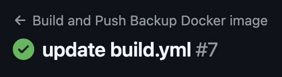

# Exercice final DevOps

## Architecture

### Les réseaux
Le système est composé de plusieurs réseaux :
- Un réseau nommé "ps-network" : celui-ci permet de connecter tous les conteneurs servants au fonctionnement du prestashop, autrement dit, le conteneur du prestashop lui même ainsi que celui de la base de données.
- Un réseau "db-network" : celui-ci permet de connecter le conteneur de la base de données à celui du phpmyadmin, et le conteneur du script de backup mysql.
- Un réseau "monitoring-network" : tous les services servant au monitoring (Grafana, Prometheus, Alertmanager, Cadvisor et Node Exporter) sont connectés à ce réseau pour leur permettre de communiquer entre eux.

### Les volumes
Plusieurs volumes sont utilisés pour stocker les données persistantes :
- ps-volume : ce volume est utilisé pour stocker les données du prestashop, afin de ne pas avoir à initialiser une nouvelle fois le prestashop au prochain démarrage.
- db-volume : ce volume est utilisé pour stocker les données de la base de données, afin de ne pas avoir à initialiser une nouvelle fois la base de données.
- grafana-volume : ce volume est utilisé pour stocker les données de Grafana, afin de ne pas avoir à réinitialiser les dashboards et les datasources à chaque redémarrage.
- backup-volume : ce volume est utilisé pour stocker les backups de la base de données, afin de ne pas perdre les données en cas de problème.

### Accès des services
Afin d'essayer de sécuriser les accès donnés aux services, un user non admin a été utilisé. Cependant, certains d'entre eux ont été laissés en accès libre car sinon ils ne fonctionnaient pas.

### Utilisation
- Prestashop : http://localhost:8080 
- Phpmyadmin : http://localhost:3307 
- Grafana : http://localhost:3000
- Prometheus : http://localhost:9090
- Alertmanager : http://localhost:9093

## Resultats
- Prestashop UI : 

- Prestashop logs: 

- Grafana :

- Database backup : 

- Successful Github Actions Pipeline : 

- Successful Docker Hub Push: 
